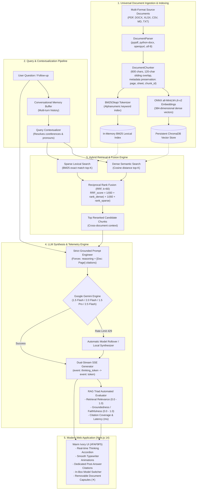

# 🧠 DocAI: Production-Grade Mini AI Knowledge Assistant

[](https://nextjs.org/)
[](https://fastapi.tiangolo.com/)
[](https://www.trychroma.com/)
[-green.svg?style=for-the-badge)]()
[](https://aistudio.google.com/)
[](https://opensource.org/licenses/MIT)

**DocAI** is an advanced, production-grade AI Knowledge Assistant engineered to ingest, index, and query complex multi-domain documents (enterprise policies, scientific research papers, financial spreadsheets, technical specifications, and student coursework) with zero hallucination, verifiable citations, dynamic real-time reasoning, and real-time retrieval evaluation.

---

## 🏗️ Detailed System Architecture



---

## 🔬 Engineering Approach & Technical Implementation

DocAI was engineered to overcome the core vulnerabilities of traditional Retrieval-Augmented Generation: keyword blindness, hallucinations, clumsy citations, and catastrophic failures during API rate-limits.

### 1. Multi-Format Ingestion & Semantic Chunking Strategy
- **Universal Document Parsing**: A unified abstraction layer ([`src/ingestion/parser.py`](src/ingestion/parser.py)) parses heterogeneous file formats into structured text objects while preserving document geometry:
  - **PDF**: Page-by-page text extraction with footer/header stripping via `pypdf`.
  - **Microsoft Word (`.docx`)**: Structural extraction preserving heading hierarchies and nested table cells via `python-docx`.
  - **Excel Spreadsheets (`.xlsx`, `.xls`)**: Tabular serialization preserving workbook sheet names, row indices, and cell formatting via `openpyxl`.
  - **Delimited Files (`.csv`, `.tsv`)**: Normalizes rows into readable, column-annotated natural language records.
  - **Plain Text & Markdown (`.md`, `.txt`, `.py`, `.json`)**: Robust multi-encoding UTF-8/Latin-1 fallback decoding.
- **Context-Aware Sliding Window Chunking**: Rather than splitting blindly at arbitrary character counts (which severs sentences and compounds errors), [`src/ingestion/chunker.py`](src/ingestion/chunker.py) uses a sliding window of **600 characters with 120-character overlap** split along linguistic boundaries (paragraphs $\to$ sentences $\to$ clauses). Every chunk retains immutable metadata: `source_file`, `page_number`, `sheet_name`, and `chunk_index`.

---

### 2. Dual-Index Hybrid Retrieval (Dense Vector + BM25Okapi)
Single-mode retrieval architectures suffer from fundamental trade-offs:
- **Dense Vector Search** (`all-MiniLM-L6-v2` / ChromaDB) excels at semantic understanding and conversational synonyms, but struggles with exact alphanumeric strings, error codes, and unique identifiers.
- **Sparse Lexical Search** (BM25Okapi) provides exact term-matching precision for acronyms, function names, and technical codes (`AES-256`, `CS-482`, `P95`), but fails when queries use paraphrased phrasing.

DocAI implements a **parallel dual-index architecture**:
1. **Dense Vector Store** ([`src/retrieval/vector_store.py`](src/retrieval/vector_store.py)): Fast, local ONNX embeddings indexed into persistent ChromaDB collections with cosine distance metric.
2. **Sparse Lexical Index** ([`src/retrieval/bm25_retriever.py`](src/retrieval/bm25_retriever.py)): An in-memory BM25Okapi inverted index tokenized on alphanumeric boundaries.

---

### 3. Reciprocal Rank Fusion (RRF, $k=60$)
To merge the disjoint ranked candidate lists from Dense and Sparse search without scale bias, DocAI utilizes **Reciprocal Rank Fusion (RRF)**:

$$RRF\_score(d) = \sum_{m \in \{dense, sparse\}} \frac{1}{k + rank_m(d)}$$

Where:
- $rank_m(d)$ is the 1-based rank position of document $d$ within retrieval method $m$.
- $k$ is the smoothing constant set to **60** (industry standard).

**Why RRF is superior to Linear Score Weighting:**
Score normalization across different retrieval modalities (e.g. cosine similarity range $[0, 1]$ vs. unbounded BM25 scores $[0, \infty)$) is notoriously sensitive to document length and query specificity. RRF operates solely on **relative rank order**, ensuring that items retrieved highly by both methods receive a dominant boost, while preserving high-confidence unique hits from either retriever.

---

### 4. Dynamic Step-by-Step Thinking & Dual-Stream Generation
- **Dynamic Reasoning Extraction**: Modern models produce higher quality, better grounded answers when allowed to reason through evidence before speaking. DocAI instructs Gemini via system prompts to formulate an explicit thought trace inside `<thought>...</thought>` tags.
- **Dual-Stream Server-Sent Events (SSE)**: Rather than buffering or dumping raw thought tags on screen, the FastAPI backend ([`backend/server.py`](backend/server.py)) parses tokens on-the-fly and streams two distinct event channels:
  1. `event: thinking_token`: Populates the collapsible contemplation drawer with subtle shimmer animation in real-time.
  2. `event: token`: Paces answer tokens chunk-by-chunk using a natural typewriter animation directly into the message body.
- **Pure Google Gemini Architecture**: Configured for high-throughput, low-latency reasoning across four specialized models:
  - **Gemini 1.5 Flash** (Default • Recommended general assistant)
  - **Gemini 2.0 Flash** (Next-Gen high-speed multimodal reasoning)
  - **Gemini 1.5 Pro** (Deep reasoning for complex multi-document synthesis)
  - **Gemini 2.5 Flash** (Experimental preview reasoning engine)

---

### 5. Anti-Hallucination Guardrails & Zero-Crash Resilience
- **Strict Factual Containment**: The generation prompt ([`src/generation/prompts.py`](src/generation/prompts.py)) establishes strict guardrails: answers must be derived *exclusively* from retrieved passages. When facts are absent or ambiguous, the model is explicitly constrained to state that insufficient information is available.
- **Dedicated Non-Intrusive Citations**: In-text superscript interruptions fragment reading comprehension. DocAI formats citations cleanly *after* the synthesized answer, providing structured citation cards with source filenames, page numbers, relevance confidence scores, and verbatim excerpt quotes.
- **Graceful Quota Degradation**: If Google AI Studio returns `429 RESOURCE_EXHAUSTED`, DocAI automatically cascades across fallback models. If completely offline or unauthenticated, the **Local Grounded Synthesizer** takes over, extracting and presenting verified facts deterministically with zero system crashes.

---

### 6. Automated RAG Triad Telemetry & Quality Assessment
Every synthesized answer is evaluated in real-time by [`src/evaluation/evaluator.py`](src/evaluation/evaluator.py) against the **RAG Triad**:
1. **Retrieval Relevance**: Measures token-level intent overlap between the user's query and the top retrieved passages.
2. **Groundedness / Faithfulness**: Computes the ratio of synthesized claims that are verified by retrieved passage content (preventing hallucinations).
3. **Citation Coverage**: Verifies that assertions link directly back to indexed documents.
4. **Latency Profiling**: Reports separate latency metrics for retrieval phase ($t_{retrieval}$) versus LLM token synthesis ($t_{generation}$) in milliseconds.

---

### 7. Granular Document Lifecycle & Self-Healing Index
Unlike primitive RAG demos where the entire database must be wiped to update documents, DocAI features an interactive document manager:
- Each uploaded file is rendered as an individual capsule chip in the input interface.
- Clicking the `✕` button triggers `DELETE /api/documents/{filename}`:
  1. Identifies and purges all associated chunk IDs from the ChromaDB collection.
  2. Removes the file's text from memory and re-tokenizes the remaining corpus.
  3. Rebuilds the BM25Okapi index dynamically in sub-second time without index corruptions or restart requirements.

---

## 📊 Comparison: Naive RAG vs. DocAI

| Dimension | Naive Tutorial RAG | **DocAI Production Engine** |
| :--- | :--- | :--- |
| **Retrieval Mode** | Dense Vector Only (Cosine distance) | **Hybrid Search (Dense ChromaDB + Sparse BM25 via RRF, $k=60$)** |
| **Domain Terminology** | Often misses exact acronyms, codes, and IDs | **BM25 captures exact lexical tokens (`AES-256`, `CS-482`, `P95`)** |
| **Chunking Logic** | Blind character slicing (cuts words/sentences) | **Context-Aware Semantic Chunking with sliding overlap** |
| **Source Attribution** | Clumsy inline tags or completely missing | **Dedicated Post-Answer Citations with page, score & excerpts** |
| **Thinking Mode** | Static canned text | **Dynamic step-by-step `<thought>` reasoning streamed in real-time** |
| **Document Management** | All-or-nothing wipe | **Granular individual document removal (✕) with live re-indexing** |
| **Hallucination Control**| Prone to creative extrapolation | **Strict Grounding Policy & Out-of-Domain Refusal** |
| **Conversational Memory**| Single turn or naive concatenation | **Follow-up Query Contextualizer & Reformulation** |
| **Quality Evaluation** | None (Anecdotal inspection) | **Automated RAG Triad Telemetry (Groundedness, Relevance, Latency)** |
| **Quota Resilience** | Crashes on 429 or quota limit | **Automatic Gemini model rollover + Local Grounded Synthesizer** |

---

## 📁 Repository Structure

```
RAG/
├── frontend/                     # Modern Next.js 14 Web Application
│   ├── app/
│   │   ├── page.tsx              # Main chat interface, model switcher & document chips
│   │   ├── layout.tsx            # Root layout, fonts & metadata
│   │   └── globals.css           # Warm paper theme & shimmer animations
│   ├── components/
│   │   └── MarkdownRenderer.tsx  # Markdown renderer with clean citation parser
│   ├── package.json              # Next.js & Tailwind dependencies
│   └── next.config.js            # API rewrites & production routing
├── backend/                      # FastAPI Server
│   └── server.py                 # Multi-format ingestion, deletion, SSE chat & telemetry
├── src/                          # Modular Production RAG Engine
│   ├── config.py                 # Hyperparameters, paths & Gemini model list
│   ├── pipeline.py               # Orchestrator connecting all RAG components
│   ├── ingestion/
│   │   ├── parser.py             # Universal document parser (PDF, DOCX, XLSX, CSV, MD, TXT)
│   │   └── chunker.py            # Semantic chunker with sliding overlap & metadata
│   ├── retrieval/
│   │   ├── vector_store.py       # ChromaDB persistent dense vector store
│   │   ├── bm25_retriever.py     # BM25Okapi lexical index with dynamic reindexing
│   │   └── hybrid.py             # Reciprocal Rank Fusion (RRF, k=60) engine
│   ├── generation/
│   │   ├── prompts.py            # Strict grounding, anti-hallucination & thought tags
│   │   ├── llm_client.py         # Gemini Flash & Pro client with automatic rollover
│   │   └── memory.py             # Multi-turn conversational memory & query reformulator
│   └── evaluation/
│       └── evaluator.py          # RAG Triad automated metrics (Relevance, Groundedness, Latency)
├── sample_docs/                  # Multi-domain sample knowledge portfolio
│   ├── engineering_specification.pdf
│   ├── platform_engineering_guidelines.docx
│   ├── quarterly_performance.xlsx
│   ├── performance_benchmarks.csv
│   ├── enterprise_cloud_security_policy.md
│   ├── distributed_systems_syllabus.md
│   └── quantum_computing_research.txt
├── tests/                        # Comprehensive test suite
│   ├── test_full_system_verification.py  # End-to-end production verification suite
│   ├── test_rag_pipeline.py              # Ingestion, chunking, retrieval & evaluation tests
│   └── test_end_to_end.py                # Full pipeline integration tests
├── Dockerfile                    # Production container image for backend
├── render.yaml                   # 1-click blueprint for Render deployment
├── vercel.json                   # Vercel deployment configuration
├── requirements.txt              # Clean Python dependencies
└── run_app.py                    # One-click launcher for backend + frontend
```

---

## 🚀 Local Quickstart (One Command)

**Requirements**: Python 3.10+ and Node.js 18+ installed on your machine. That's it.

```bash
git clone https://github.com/Joshan2007/DocAI-RAG.git
cd DocAI-RAG
python run_app.py
```

The launcher does everything automatically on first run:

| Step | What happens |
|------|-------------|
| **1** | Creates a Python virtual environment (`.venv`) |
| **2** | Installs all Python dependencies from `requirements.txt` |
| **3** | Installs all Node.js dependencies (`npm install` in `frontend/`) |
| **4** | Prompts you for your **Gemini API key** (one time only — saved to `.env`) |
| **5** | Starts both servers |

> Get a free Gemini API key at [https://aistudio.google.com/app/apikey](https://aistudio.google.com/app/apikey)

On every subsequent run, steps 1–3 are skipped (already installed) and step 4 is skipped (key already in `.env`). Cold start to app in < 5 seconds.

Once running:
- **Web Interface** → [http://localhost:3000](http://localhost:3000)
- **API Explorer** → [http://127.0.0.1:8000/docs](http://127.0.0.1:8000/docs)
- **Health Check** → [http://127.0.0.1:8000/api/health](http://127.0.0.1:8000/api/health)

Press `Ctrl+C` to stop both servers cleanly.

### Run Automated Tests
```bash
# Activate the venv first, then:
.venv\Scripts\activate   # Windows
source .venv/bin/activate  # macOS / Linux

pytest tests/ -v
```


---

## 🌐 Production Deployment Guide

DocAI has a decoupled, modern cloud architecture:
- **Frontend**: Next.js 14 deployed to **Vercel** (Edge CDN, fast loading, zero configuration).
- **Backend**: FastAPI + ChromaDB deployed to **Render**, **Railway**, **Google Cloud Run**, or **Fly.io** (persistent storage, Python runtime).

---

### Step 1: Deploy Backend (FastAPI + ChromaDB) to Render (Free & 1-Click)

1. Go to [Render.com](https://render.com/) and click **New +** $\to$ **Blueprint**.
2. Select your repository `Joshan2007/DocAI-RAG`.
3. Render automatically detects [`render.yaml`](render.yaml) and configures:
   - Build command: `pip install -r requirements.txt`
   - Start command: `uvicorn backend.server:app --host 0.0.0.0 --port $PORT`
4. Under Environment Variables, add:
   - `GEMINI_API_KEY`: Your Gemini API key.
5. Click **Apply**. Render will deploy your service and provide a public URL:
   `https://docai-backend.onrender.com`

*(Alternatively, use the included [`Dockerfile`](Dockerfile) to deploy to Railway, Google Cloud Run, or any Docker host).*

---

### Step 2: Deploy Frontend to Vercel via GitHub Integration

1. Go to [Vercel.com](https://vercel.com/) and click **Add New...** $\to$ **Project**.
2. Select your repository `Joshan2007/DocAI-RAG` from your GitHub account.
3. Configure settings:
   - **Framework Preset**: Next.js (detected automatically).
   - **Root Directory**: `frontend` (or leave as root, handled by [`vercel.json`](vercel.json)).
4. Under **Environment Variables**, add:
   - `NEXT_PUBLIC_API_URL`: Your backend URL from Step 1 (e.g. `https://docai-backend.onrender.com`).
5. Click **Deploy**.

Vercel will build and deploy the Next.js 14 frontend in seconds! Any future pushes to your GitHub repository will trigger automatic deployments.

---

## 📄 License
This project is open-source under the [MIT License](LICENSE).
