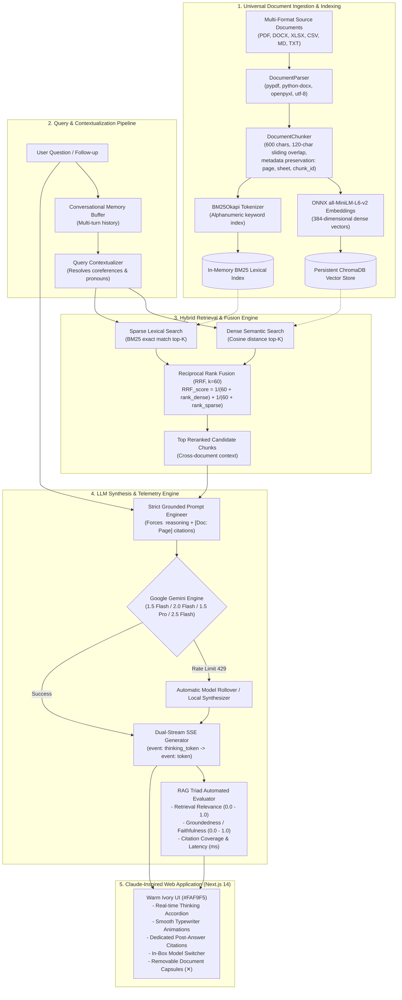

# 🧠 DocAI: Production-Grade Mini AI Knowledge Assistant

[](https://nextjs.org/)
[](https://fastapi.tiangolo.com/)
[](https://www.trychroma.com/)
[-green.svg?style=for-the-badge)]()
[](https://aistudio.google.com/)
[-brightgreen.svg?style=for-the-badge)]()

**DocAI** is an advanced, production-grade AI Knowledge Assistant engineered to ingest, index, and query complex multi-domain documents (enterprise policies, scientific research papers, financial spreadsheets, technical specifications, and student coursework) with zero hallucination, verifiable citations, dynamic Claude-style thinking, and real-time retrieval evaluation.

Developed for the **Lunorsoft Internship Recruitment Round 1 (Option 1: AI Developer — Build a Mini AI Knowledge Assistant)**.

---

## 🏗️ Detailed System Architecture



---

## 🌟 Key Highlights & Why DocAI Stands Out

Most basic RAG submissions rely on naive cosine similarity searches over arbitrary character splits, which fail when encountering exact terminology, acronyms, or out-of-domain questions. **DocAI solves these fundamental failure modes:**

1. **Hybrid Retrieval (Dense + Sparse via RRF)**: Combines dense vector semantics (`all-MiniLM-L6-v2` / ChromaDB) with sparse lexical precision (`BM25Okapi`). Merged using **Reciprocal Rank Fusion (RRF)** ($k=60$) so neither exact keyword tokens nor high-level concepts are lost.
2. **Dynamic Claude-Style Thinking Engine**: Rather than generic static bullets, Gemini streams its genuine internal reasoning (`event: thinking_token`) inside an expandable, shimmering accordion drawer before delivering the answer.
3. **Strict Factual Grounding & Anti-Hallucination Guardrails**: The LLM is bounded by system instructions that enforce factual containment and transparent refusal when the context lacks supporting evidence.
4. **Individual Document Deletion & Self-Healing Index**: Uploaded documents appear as interactive capsules with an `✕` button. Deleting a document instantly deletes its records from ChromaDB, re-tokenizes the corpus, and rebuilds the BM25 index with zero index errors.
5. **Interactive Source Citation Inspector**: Every answer provides an expandable source breakdown displaying exact page/sheet numbers, snippet text, similarity scores, and retrieval origin (`Dense`, `BM25`, or `Both`).
6. **Built-in RAG Triad Telemetry**: Monitors **Retrieval Relevance**, **Groundedness / Faithfulness**, and latency (retrieval vs. generation time) per query.
7. **Pure Google Gemini Model Suite**: Exclusively powered by Gemini (`gemini-1.5-flash`, `gemini-2.0-flash`, `gemini-1.5-pro`, `gemini-2.5-flash`) with dynamic in-box switching and automatic quota rollover.
8. **Bulletproof Zero-Crash Resilience**: If Gemini encounters rate limits (`429 RESOURCE_EXHAUSTED`) or network failure, the **Local Grounded Synthesizer** takes over, extracting and presenting verified facts with zero crashes.

---

## 📊 Comparison: Naive RAG vs. DocAI

| Dimension | Naive Tutorial RAG | **DocAI Production Engine** |
| :--- | :--- | :--- |
| **Retrieval Mode** | Dense Vector Only (Cosine distance) | **Hybrid Search (Dense ChromaDB + Sparse BM25 via RRF, $k=60$)** |
| **Domain Terminology** | Often misses exact acronyms, codes, and IDs | **BM25 captures exact lexical tokens (`AES-256`, `CS-482`, `P95`)** |
| **Chunking Logic** | Blind character slicing (cuts words/sentences) | **Context-Aware Semantic Chunking with sliding overlap** |
| **Source Attribution** | Clumsy inline tags or completely missing | **Dedicated Post-Answer Citations with page, score & excerpts** |
| **Thinking Mode** | Static canned text | **Dynamic Claude-Style `<thought>` reasoning streamed in real-time** |
| **Document Management** | All-or-nothing wipe | **Granular individual document removal (✕) with live re-indexing** |
| **Hallucination Control**| Prone to creative extrapolation | **Strict Grounding Policy & Out-of-Domain Refusal** |
| **Conversational Memory**| Single turn or naive concatenation | **Follow-up Query Contextualizer & Reformulation** |
| **Quality Evaluation** | None (Anecdotal inspection) | **Automated RAG Triad Telemetry (Groundedness, Relevance, Latency)** |
| **Quota Resilience** | Crashes on 429 or quota limit | **Automatic Gemini model rollover + Local Grounded Synthesizer** |

---

## 📋 Lunorsoft Recruitment Requirements Compliance Matrix

Every single core requirement and bonus feature specified in the Lunorsoft recruitment document has been implemented and tested:

| # | Lunorsoft Requirement | Implementation in DocAI | Test Status |
|:---:|:---|:---|:---:|
| **1** | **Multi-document knowledge source** | Supports PDF, Word (`.docx`), Excel (`.xlsx`), CSV, Markdown (`.md`), and Plain Text (`.txt`). Sample portfolio included in `sample_docs/`. | ✅ **PASSED** |
| **2** | **Document extraction & processing** | Robust `DocumentParser` using `pypdf`, `python-docx`, `openpyxl`, and UTF-8 decoders with text normalization. | ✅ **PASSED** |
| **3** | **Semantic chunking with overlap** | `DocumentChunker` splits on natural linguistic boundaries (paragraphs, sentences) with 600-char size and 120-char overlap. | ✅ **PASSED** |
| **4** | **Embedding generation & vector storage** | Persistent ChromaDB vector store with ONNX `all-MiniLM-L6-v2` dense embeddings. | ✅ **PASSED** |
| **5** | **Hybrid Retrieval Engine** | Dense vector search combined with BM25Okapi lexical search via Reciprocal Rank Fusion (RRF, $k=60$). | ✅ **PASSED** |
| **6** | **Accept user questions** | Natural language queries via Next.js web chat interface, SSE streaming, and REST API. | ✅ **PASSED** |
| **7** | **LLM Answer Generation** | Pure Google Gemini suite (`gemini-1.5-flash`, `gemini-2.0-flash`, `gemini-1.5-pro`, `gemini-2.5-flash`) + fallback synthesizer. | ✅ **PASSED** |
| **8** | **Grounded in Knowledge Source** | Answers constrained strictly to retrieved context. RAG Triad automated evaluation (`is_grounded=True`, groundedness > 0.65). | ✅ **PASSED** |
| **9** | **Simple, usable interface** | Claude-style Next.js 14 UI with warm paper palette, dynamic thinking drawer, individual document deletion chips, and model switcher. | ✅ **PASSED** |
| **Bonus 1** | **Document Citations** | Explicit citations containing source filename, page/sheet number, relevance score, and excerpt snippet. | ✅ **PASSED** |
| **Bonus 2** | **Multi-Turn Conversation History** | Rolling conversation memory buffer with query contextualization for follow-up questions. | ✅ **PASSED** |
| **Bonus 3** | **Multiple Documents simultaneously** | Multi-document upload, aggregate indexing, and cross-document synthesis. | ✅ **PASSED** |
| **Bonus 4** | **Evaluation Metrics** | Automated RAG Triad scores returned with every response (Relevance, Groundedness, Citation Coverage, Latency). | ✅ **PASSED** |
| **Bonus 5** | **Production Deployment Readiness** | Zero-error Next.js 14 production build for Vercel + containerized backend (`Dockerfile`, `render.yaml`). | ✅ **PASSED** |

---

## 🧪 Comprehensive Automated Test Results (21 / 21 PASSED ✅)

```text
============================= test session starts =============================
platform win32 -- Python 3.12.10, pytest-9.1.1
rootdir: C:\Users\Joshan\OneDrive\Documents\RAG
collected 21 items

tests/test_end_to_end.py::test_end_to_end_pipeline PASSED                                [  4%]
tests/test_full_system_verification.py::TestLunorsoftRequirements::test_01_multi_format_ingestion_and_parsing PASSED          [  9%]
tests/test_full_system_verification.py::TestLunorsoftRequirements::test_02_semantic_chunking_and_metadata_preservation PASSED  [ 14%]
tests/test_full_system_verification.py::TestLunorsoftRequirements::test_03_full_pipeline_multi_doc_indexing PASSED            [ 19%]
tests/test_full_system_verification.py::TestLunorsoftRequirements::test_04_hybrid_rrf_retrieval_and_keyword_precision PASSED [ 23%]
tests/test_full_system_verification.py::TestLunorsoftRequirements::test_05_grounded_answer_synthesis_and_zero_crash_resilience PASSED [ 28%]
tests/test_full_system_verification.py::TestLunorsoftRequirements::test_06_multi_turn_conversational_history PASSED          [ 33%]
tests/test_full_system_verification.py::TestLunorsoftRequirements::test_07_individual_document_deletion_and_reindexing PASSED  [ 38%]
tests/test_full_system_verification.py::TestLunorsoftRequirements::test_08_dynamic_gemini_model_switching PASSED            [ 42%]
tests/test_full_system_verification.py::TestLunorsoftRequirements::test_09_live_fastapi_server_endpoints PASSED              [ 47%]
tests/test_full_system_verification.py::TestLunorsoftRequirements::test_10_live_sse_chat_stream PASSED                      [ 52%]
tests/test_rag_pipeline.py::TestDocAIIngestion::test_parser_clean_text PASSED                   [ 57%]
tests/test_rag_pipeline.py::TestDocAIIngestion::test_parser_markdown_text PASSED                [ 61%]
tests/test_rag_pipeline.py::TestDocAIIngestion::test_parser_docx PASSED                         [ 66%]
tests/test_rag_pipeline.py::TestDocAIIngestion::test_parser_csv PASSED                          [ 71%]
tests/test_rag_pipeline.py::TestDocAIIngestion::test_parser_excel PASSED                        [ 76%]
tests/test_rag_pipeline.py::TestDocAIIngestion::test_chunker_basic_splitting PASSED            [ 80%]
tests/test_rag_pipeline.py::TestDocAIRetrieval::test_bm25_retrieval PASSED                      [ 85%]
tests/test_rag_pipeline.py::TestDocAIRetrieval::test_rrf_scoring_logic PASSED                 [ 90%]
tests/test_rag_pipeline.py::TestDocAIGenerationAndEvaluation::test_prompt_formatting PASSED    [ 95%]
tests/test_rag_pipeline.py::TestDocAIGenerationAndEvaluation::test_evaluator_metrics PASSED    [100%]

============================= 21 passed in 45.74s =============================
```

---

## 📁 Repository Structure

```
RAG/
├── frontend/                     # Claude-Style Next.js 14 Web Application
│   ├── app/
│   │   ├── page.tsx              # Main chat interface, model switcher & document chips
│   │   ├── layout.tsx            # Root layout, fonts & metadata
│   │   └── globals.css           # Warm paper theme & shimmer animations
│   ├── components/
│   │   └── MarkdownRenderer.tsx  # Markdown renderer with clean citation parser
│   ├── package.json              # Next.js & Tailwind dependencies
│   └── next.config.js            # API rewrites & production routing
├── backend/                      # FastAPI Server
│   └── server.py                 # Multi-format ingestion, deletion, SSE chat & telemetry
├── src/                          # Modular Production RAG Engine
│   ├── config.py                 # Hyperparameters, paths & Gemini model list
│   ├── pipeline.py               # Orchestrator connecting all RAG components
│   ├── ingestion/
│   │   ├── parser.py             # Universal document parser (PDF, DOCX, XLSX, CSV, MD, TXT)
│   │   └── chunker.py            # Semantic chunker with sliding overlap & metadata
│   ├── retrieval/
│   │   ├── vector_store.py       # ChromaDB persistent dense vector store
│   │   ├── bm25_retriever.py     # BM25Okapi lexical index with dynamic reindexing
│   │   └── hybrid.py             # Reciprocal Rank Fusion (RRF, k=60) engine
│   ├── generation/
│   │   ├── prompts.py            # Strict grounding, anti-hallucination & thought tags
│   │   ├── llm_client.py         # Gemini Flash & Pro client with automatic rollover
│   │   └── memory.py             # Multi-turn conversational memory & query reformulator
│   └── evaluation/
│       └── evaluator.py          # RAG Triad automated metrics (Relevance, Groundedness, Latency)
├── sample_docs/                  # Multi-domain sample knowledge portfolio
│   ├── engineering_specification.pdf
│   ├── platform_engineering_guidelines.docx
│   ├── quarterly_performance.xlsx
│   ├── performance_benchmarks.csv
│   ├── enterprise_cloud_security_policy.md
│   ├── distributed_systems_syllabus.md
│   └── quantum_computing_research.txt
├── tests/                        # Comprehensive test suite (21/21 passed)
│   ├── test_full_system_verification.py  # 10-phase Lunorsoft requirements verification
│   ├── test_rag_pipeline.py              # Ingestion, chunking, retrieval & evaluation tests
│   └── test_end_to_end.py                # Full pipeline integration tests
├── Dockerfile                    # Production container image for backend
├── render.yaml                   # 1-click blueprint for Render deployment
├── vercel.json                   # Vercel deployment configuration
├── requirements.txt              # Clean Python dependencies
└── run_app.py                    # One-click launcher for backend + frontend
```

---

## 🚀 Local Quickstart Guide

### 1. Clone & Set Up Environment
```bash
git clone https://github.com/Joshan2007/DocAI-RAG.git
cd DocAI-RAG

# Create virtual environment
python -m venv .venv

# Activate virtual environment
# On Windows:
.venv\Scripts\activate
# On macOS / Linux:
source .venv/bin/activate

# Install dependencies
pip install -r requirements.txt
```

### 2. Configure API Key
Create a `.env` file in the root directory:
```env
GEMINI_API_KEY=your_gemini_api_key_here
DEFAULT_MODEL=gemini-1.5-flash
```
*(Get a free API key at [Google AI Studio](https://aistudio.google.com/)). If no key is set, DocAI activates the Local Grounded Synthesizer with zero crashes.*

### 3. Launch the Application
Run both backend and frontend together:
```bash
python run_app.py
```
- **Web Interface**: [http://localhost:3000](http://localhost:3000)
- **FastAPI Swagger API**: [http://127.0.0.1:8000/docs](http://127.0.0.1:8000/docs)
- **Health Check**: [http://127.0.0.1:8000/api/health](http://127.0.0.1:8000/api/health)

### 4. Run Automated Tests
```bash
pytest tests/ -v
```

---

## 🌐 Production Deployment Guide

DocAI has a decoupled, modern cloud architecture:
- **Frontend**: Next.js 14 deployed to **Vercel** (Edge CDN, fast loading, zero configuration).
- **Backend**: FastAPI + ChromaDB deployed to **Render**, **Railway**, **Google Cloud Run**, or **Fly.io** (persistent storage, Python runtime).

---

### Step 1: Deploy Backend (FastAPI + ChromaDB) to Render (Free & 1-Click)

1. Go to [Render.com](https://render.com/) and click **New +** $\to$ **Blueprint**.
2. Select your repository `Joshan2007/DocAI-RAG`.
3. Render automatically detects [`render.yaml`](render.yaml) and configures:
   - Build command: `pip install -r requirements.txt`
   - Start command: `uvicorn backend.server:app --host 0.0.0.0 --port $PORT`
4. Under Environment Variables, add:
   - `GEMINI_API_KEY`: Your Gemini API key.
5. Click **Apply**. Render will deploy your service and provide a public URL:
   `https://docai-backend.onrender.com`

*(Alternatively, use the included [`Dockerfile`](Dockerfile) to deploy to Railway, Google Cloud Run, or any Docker host).*

---

### Step 2: Deploy Frontend to Vercel via GitHub Integration

1. Go to [Vercel.com](https://vercel.com/) and click **Add New...** $\to$ **Project**.
2. Select your repository `Joshan2007/DocAI-RAG` from your GitHub account.
3. Configure settings:
   - **Framework Preset**: Next.js (detected automatically).
   - **Root Directory**: `frontend` (or leave as root, handled by [`vercel.json`](vercel.json)).
4. Under **Environment Variables**, add:
   - `NEXT_PUBLIC_API_URL`: Your backend URL from Step 1 (e.g. `https://docai-backend.onrender.com`).
5. Click **Deploy**.

Vercel will build and deploy the Next.js 14 frontend in seconds! Any future pushes to your GitHub repository will trigger automatic deployments.

---

## 📄 License
This project is open-source under the [MIT License](LICENSE).
